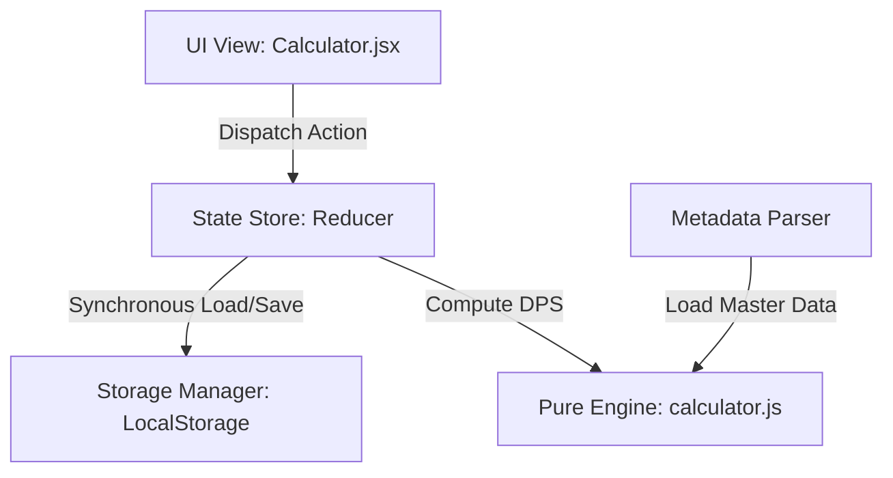

작성일: 2026-07-10
작성자: Antigravity

# 격투가 종합 계산기 아키텍처 리팩토링 분석 및 개선 보고서

현재 격투가 종합 계산기 프로그램은 단기적인 버그 해결과 마MASTER 마크다운 명세 결합을 반복하는 과정에서 내부 상태(State) 동기화 파이프라인 및 연산 엔진의 결합도가 심각하게 꼬여 있는 상태입니다. 

이에 대한 기술적 부채 진단과 근본적인 아키텍처 리팩토링 전략을 보고합니다.

---

## 1. 근본적인 코드 꼬임 원인 진단 (Root Causes)

### 1-1. 상태 관리의 다원화와 레이스 컨디션 (Race Condition)
- **증상**: 새로고침이나 세션 로딩 시 사용자의 프리셋과 세공 상태가 초기화되거나 덮어쓰여 유실되는 현상 발생.
- **원인**: `Calculator.jsx` 내부에서 룬, 보석, 인장, 스펙창 입력 상태(`selectedRunes`, `gems`, `seals`, `stats`)가 개별적인 `useState`로 다원화되어 있습니다. 
  - 리액트 마운트 직후 초기값 바인딩에 의해 `useEffect` 자동 저장 기능이 복구 로직보다 먼저 연쇄 트리거되어 스토리지를 강제로 오염 덮어쓰는 구조적 한계를 가지고 있었습니다.
  - 임시 조치로 `isLoaded` 플래그를 도입했으나, 이는 근본적인 해결책이 아닌 임시 가드(Guard) 조치에 불과합니다.

### 1-2. 도메인 경계 유실 (연산 엔진과 UI 컴포넌트의 결합)
- **증상**: 계산 공식 수정 시 `Calculator.jsx` 와 `calculator.js` 양쪽 파일의 매개변수를 매번 동시에 맞교환하고 파이프라인을 기워 넣어야 함.
- **원인**: 연산 엔진(`calculator.js`)은 순수 함수여야 하나, UI에서 제공하는 상태 가공 데이터와 지나치게 넓은 표면적(9개의 파라미터)으로 긴밀하게 결합되어 있어 리팩토링이나 수식 변경 시 사이드 이펙트가 매우 큽니다.

### 1-3. 마스터 문서 데이터 바인딩의 동기성 격차
- **증상**: 빌드 시점의 정적 마크다운 분석(`?raw` 로더)과 런타임 클라이언트 로드 시점의 동기화 불일치.
- **원인**: 룬 설명(`260708`) 및 스킬 목록(`260710`)을 파싱하는 파서 로직이 파일 로드 시점에 즉시 동기 실행되다 보니, 파싱 결과가 온전하지 않거나 누락될 때 연산기가 예외 처리(`fallback`)로 빠져버려 실측 딜량 격차가 발생합니다.

---

## 2. 향후 아키텍처 개선 리팩토링 방향 (Proposed Solution)

이를 근본적으로 해결하기 위해 다음 3단계 정밀 리팩토링 체계를 제안합니다.

### 2-1. 단일 상태 원천화 (Single Source of Truth - Reducer 패턴 적용)
- 개별적으로 분산되어 꼬여 있는 `useState`들을 하나의 통합 컨텍스트 상태 객체(`CalculatorState`)로 묶고, 상태 변화는 `useReducer` 또는 단일 Store를 통해서만 일어나도록 제약합니다.
- **이점**: 스토리지 로드 완료 이전에는 Dispatcher가 잠금(Lock) 상태가 되어 저장 Action 자체를 차단하므로, 레이스 컨디션에 의한 세션 데이터 오염 유실 문제를 원천적으로 방지합니다.

### 2-2. 입출력 통로 단일화 (Storage Wrapper Layer 도입)
- 로컬 스토리지의 읽기/쓰기를 컴포넌트의 라이프사이클(`useEffect`)에 맡기지 않고, 명확한 `StorageManager` 클래스나 커스텀 훅을 통해 동기적(Blocking)으로 로드가 완료된 후에만 렌더링이 시작되도록 로딩 생명주기를 완벽히 분리합니다.

### 2-3. 계산기 매개변수 구조화 및 순수성 강화
- `calculateDPS` 의 길고 꼬여 있는 9개의 매개변수를 단일 컨텍스트 매개변수(`characterContext`) 객체로 묶어 결합도를 낮추고 테스트 정합성을 확보합니다.
